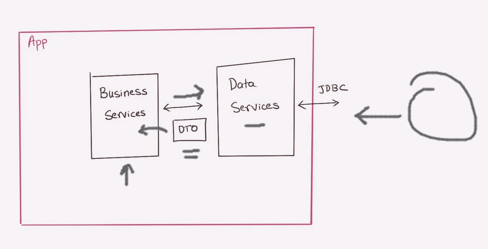

# JPA & Hibernate

## What is JPA?

The Java Persistence API (JPA) is a specification of Java. It is used to persist data between Java object and relational database. JPA acts as a bridge between object-oriented domain models and relational database systems.

As JPA is just a specification, it doesn't perform any operation by itself. It requires an implementation. So, ORM(Object–relational mapping) tools like Hibernate, TopLink and iBatis implements JPA specifications for data persistence.

### Object–relational mapping 

Object Relational Mapping (ORM) is a functionality which is used to develop and maintain a relationship between an object and relational database by mapping an object state to database column. It is capable to handle various database operations easily such as inserting, updating, deleting etc.

---

## Working of JDBC (Java Database Connectivity)

 

- Read & Write operation using JDBC

 

JPA simplifies these operations with Object–relational mapping  

 