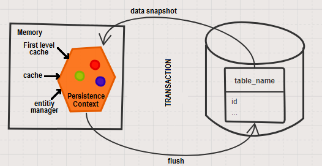

# JPA basics

## Work-flow

1. Setup a JPA project with dependencies (like hibernate-entitymanager & postgresql)
2. Create a persistance context
3. Create entities & map them to databases using JPA annotations
4. use JPA API to persist an instance to the database

    JPA bootstraps an EntityManagerFactory from persistance unit. EntityManager is responsible for creating & managing entities.

 

## Some Basic Terms & Definitions : [@](https://dzone.com/articles/resource-local-vs-jta-transaction-types-and-payara)

* <b>What Is a Persistent-Unit?</b>

    Think to the persistent-unit as a box holding all the needed information for creating an EntityManagerFactory instance. Among this information, we have details about the data source (JDBC URL, user, password, SQL dialect, etc), the list of entities that will be managed, and other specific properties.

    <i>Persistence unit as RESOURCE_LOCAL or JTA?</i> 

* <b>What Is EntityManagerFactory?</b>

    An EntityManagerFactory is a factory capable to create on-demand EntityManager instances.

    Basically, we provide the needed information via the persistent-unit, and JPA can use this information to create an EntityManagerFactory that exposes a method named, createEntityManager(), which returns a new application-managed EntityManager instance at each invocation.

* <b>What Is EntityManager? & persistence-context </b>

     

    https://dzone.com/articles/resource-local-vs-jta-transaction-types-and-payara

* <b>Persistence unit as RESOURCE_LOCAL or JTA?</b>

    * <b> JTA </b> if :

        * The application server is going to  manage the transactions? 
        * The application server is going to manage the persistence-context lifespan 
        * If Transactions span multiple persistent-units (databases) or systems (e.g., JMS, JCA, etc) 
    
    * else <b> RESOURCE_LOCAL </b>

---

## Overview of JPA/Hibernate Cascade Types : [@](https://www.baeldung.com/jpa-cascade-types)
